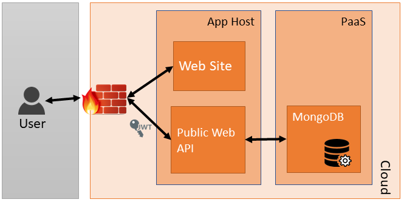

# Workshop: Cloud Modernization and Migration #

This is an 8 hour workshop including lots of hands on labs.

In this lab we'll migrate some sample application systems to, your choice of:

* Pivotal Cloud Foundry (PCF)
* Kubernetes (K8s)
* Azure (PaaS)

## Source Folders ##

You can do your projects in [.NET Core](dotnetcore%2FREADME.md) or [NodeJS](nodejs%2FREADME.md) (or if you want to start from scratch, you can roll-your-own).

## 12 Factors ##

Along the way, we'll discover how to conform the existing applications to be <a href="https://12factor.net/" target="_blank">12 Factor Applications</a>.

Here's a reminder:

### I. Codebase ###

*One codebase tracked in revision control, many deploys*

(We have this one covered, as we have GIT)

### II. Dependencies ###

*Explicitly declare and isolate dependencies*

(This is broken in our samples, you will want to fix this)

### III. Config ###

*Store config in the environment*

(This is broken in our samples, you will want to fix this)

### IV. Backing services ###

*Treat backing services as attached resources*

(This is broken in our samples, you will want to fix this)

### V. Build, release, run ###

*Strictly separate build and run stages*

(You should do this in real life, but you can skip it for now)

### VI. Processes ###

*Execute the app as one or more stateless processes*

(This is broken in our samples, you will want to fix this)

### VII. Port binding ###
*Export services via port binding*

(This is broken in our samples, you will want to fix this)

### VIII. Concurrency ###
*Scale out via the process model*

(Look out for state-fullness that will require stickiness, and fix it if you find it.)

### IX. Disposability ###
*Maximize robustness with fast startup and graceful shutdown*

(What if a piece of our puzzle crashes? Will it do the right thing? e.g. error or grace-fully recover.)

### X. Dev/prod parity ###
*Keep development, staging, and production as similar as possible*

(You should do this in real life, but you can skip it for now)

### XI. Logs ###
*Treat logs as event streams*
(We'll definitely want to do this. Make sure you focus on making the logs write to `STDOUT` (not bad things), `STDERR` (bad things)

### XII. Admin processes ###
*Run admin/management tasks as one-off processes*
(You should do this in real life, but you can skip it for now)

## Our Application ##

The application system we are updating is a site called Cat-a-log to share photos about cats and captions about the same. Users can self register, and make comments about other user's posts.

## Architecture ##

* The website is a static HTML/JavaScript/CSS3
* The API is in Code and secured by a JWT
* The API connects to the MongoDB which stores images and data